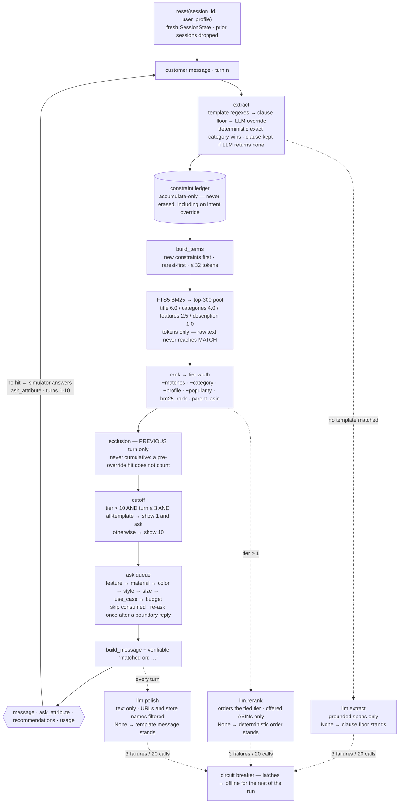

# Shopping Copilot — Technical Report

TikTok TechJam 2026 · Problem Statement 4 (Conversational E-Commerce Search) · repo `jeslynw/Shopping-Copilot`

> **v1.0 skeleton (29 Aug 2026).** Every number below is measured on the 200 public sessions with the vendored, unmodified
> `evaluator/local_evaluator.py`. Rows marked ⟳ are regenerated from code at each tag (`tools/ablate.py`,
> `tools/run_eval.py --profile`). "Paraphrased" numbers come from a **dev harness** (the simulator's strings are swapped
> in-process; the evaluator file is never edited) and are *not* the official local score. Prose is completed in P6;
> numbers are final unless re-measured.

## 1. Result at a glance

| agent — 200 public sessions, official evaluator | HR@10 | MRR | MTTC | **TechnicalScore** |
|---|---|---|---|---|
| kit starter (stateless BM25, `AGENT=baseline python3 -m evaluator.local_evaluator`) | 0.125 | 0.068 | 9.81 | 0.107 |
| **Shopping Copilot — deterministic core = the scored configuration** | **1.000** | **0.937** | **2.155** | **0.958** |
| same, LLM message polish on (full 200-session live run, 431 calls, 0 failures: per-session results identical — `docs/results/v1.0_llm_polish.json`) | 1.000 | 0.937 | 2.155 | 0.958 (= by construction) |
| Shopping Copilot under LLM-paraphrased simulator strings (dev harness, §7) | 0.995 | 0.820 | 1.98 | 0.924 |
| Shopping Copilot on **1,000 held-out sessions** from the source dataset — last purchase of 5-core reviewers, the organizers' sampling (§5.1) | 0.981 | 0.937 | 2.50 | 0.942 |
| same, 1,000 uniformly random catalog products as targets — no popularity skew (§5.1) | 0.922 | 0.861 | 3.29 | 0.873 |

`TechnicalScore = 0.5·HR@10 + 0.3·MRR + 0.2·clip((11 − MTTC)/10)`. Bootstrap 95 % CI of the shipped score on 200
sessions: **[0.948, 0.967]**. The scored configuration has **no runtime dependencies, makes no network calls, answers a
turn in ≈ 36 ms (p95 68 ms) and uses 379 MB RSS including the harness's own catalog copy** (§9).

## 2. What the evaluator rewards — and what we built for it

The kit's customer is a deterministic rule function, not a person. Reading it (`docs/PLAN.md` §2) fixed the design:

- **Every turn is scored *and* asked.** Recommendations are checked for the target each turn, then the customer replies
  according to `ask_attribute`. There is no ask-vs-show trade-off: always do both.
- **`ask_attribute` is the only information channel.** Each ask reveals ≤ 2 undisclosed requirements whose
  `classify_constraint()` bucket matches; `category` and `brand` can never match (dead asks); `null` reveals nothing.
  Payoff measured over the public targets: feature 95.8 % · material 56.8 % · color 42.5 % · style 16.7 % · size 7.6 %.
- **Requirements are verbatim substrings of the target listing** (`features` / `details` / a material or colour regex).
  A candidate that contains *every* stated requirement is almost certainly the target → a constraint ledger with exact
  substring satisfaction is the centre of the system, not an LLM's judgement.
- **The turn-1 message discloses the target's coarse category** ("I'm looking for Women Dresses…") → resolved against
  the finite vocabulary (1,115 phrases) of `coarse_category()` values over the catalog.
- **A hit ends the session**, so MRR can only improve by *not* showing a wide tie → the information-gated shelf (§4.6).
- **"Actually, ignore my earlier preference" is a trap**: old and new value both describe the same product. Accumulate
  everything, erase nothing; pre-override hits do not count, which rules out any cumulative "seen" set (§4.7).
- **Organizers may paraphrase the simulator and may disable the network** → template-free clause extraction with a
  committed LLM-generated paraphrase fixture, and an LLM layer that can only ever change the message text.

## 3. Architecture



**The three dotted branches are the LLM layer.** It switches on automatically when an API key is present
(`OPENAI_API_KEY` or `ANTHROPIC_API_KEY`); `llm_polish` runs by default, and `llm_extract` and `llm_rerank`
are one flag each. Every stage is an *override* of a result the deterministic spine has already computed, so
any failure — no key, no SDK, connection error, budget overrun, unparseable output — leaves that result
standing. Only the breaker is sticky.

That inversion is the whole reliability argument: the model is never on the critical path, so an outage costs
wording, not correctness. It is also why the scored run is reproducible while still being able to use a model
(§8, §9).

| module | role | guarantee |
|---|---|---|
| `copilot/catalog.py` | streams `catalog.jsonl(.gz)`, builds an in-memory FTS5 index (starter schema + column weights); Python keeps only `asin → (rowid, rating_number, coarse category, price)` | memory-lean: pool text is fetched from FTS5 per turn |
| `copilot/extract.py` | simulator-template regexes first; template-free clause splitter with lead-in peeling second; every constraint tagged `template` or `clause` | never raises; category resolution 200/200 on clean and paraphrased openers |
| `copilot/state.py` | `SessionState`: constraint ledger, categories, asked/consumed attributes, previous shelf | accumulate-only |
| `copilot/retrieve.py` | tokens-only FTS5 OR query (never raw text in `MATCH`), ≤ 32 terms, newest constraint's tokens always kept | 0 `OperationalError` on 5k+800 fuzzed strings |
| `copilot/rank.py` | exact verbatim satisfaction over the evaluator's six search fields (`norm()`: casefold + whitespace, both `key: value` forms, colour/budget forms); sort key `(-n_match, -cat_match, -rating_number, bm25_rank, parent_asin)`; `tier_size` = width of the top tier; per-item explanation = matched constraints | fully deterministic; 800/800 public constraints self-match their target |
| `copilot/policy.py` | fixed ask queue (skips consumed, re-asks after a boundary reply); information-gated cutoff; previous-turn-only exclusion | no scenario/override detection anywhere in the scoring path |
| `copilot/respond.py` | deterministic message with a verifiable "matched on" explanation; never asserts "found it" | |
| `copilot/llm.py` | OpenAI (default `gpt-4.1-mini`) or Anthropic provider, on automatically when a key is present; `llm_polish` by default, `llm_extract` and `llm_rerank` behind one flag each; 4 s per-turn budget, `max_retries=0`, failure budget 3/20 → breaker | every stage is an override of an already-computed deterministic result; a failure of any kind leaves the spine standing |
| `copilot/agent.py` | `__init__`/`reset`/`respond` never raise; every response has exactly the 4 contract keys; `state.prev` written only after the response validates and the turn is under budget | exception = miss is designed out |
| `agent.py`, `starter/agent.py` | shims (`sys.path` bootstrap) so the kit command runs unmodified from any CWD | 3 import modes tested |

## 4. Method, layer by layer (each is a `Config` flag — `tools/ablate.py` flips them)

1. **Extraction with provenance** (`extractor=hybrid`). The seven simulator templates are matched exactly; anything else
   goes to the clause extractor: category phrase removed, request boilerplate and lead-ins peeled ("Oh, for that one,
   what matters is: Imported" → `Imported`), clauses split on `.`/`;`/dashes. Provenance (`template`|`clause`) is
   carried into the cutoff gate.
2. **Retrieval** (`query_source=extracted`, `max_terms=32`, `pool=300`). FTS5 BM25 over category + constraint tokens,
   rarest-first when over the cap. Pool 300 is a tuned hyper-parameter (1000 scores lower — the pool acts as a
   regularizer).
3. **Constraint ledger + verbatim satisfaction rerank** (`rerank`, `norm_match`, `match_fields=six`). Candidates are
   sorted by how many stated requirements they contain verbatim. This is the centrepiece: HR 0.875 → 0.975.
4. **Coarse-category sort key** (`cat_sort_key`): +0.02 as a *sort key* where a hard filter lost 0.06 (§6).
5. **Popularity prior** (`tiebreak=popularity`) — **MostPop, named as such.** Among items tied on requirements and
   category, prefer the most-reviewed. It works because sessions are leave-last-out purchases from 5-core reviews:
   target `rating_number` median 6,846 vs catalog 12; 163/200 public targets are in the top 10 of their coarse
   category, 70/200 are #1, 142/200 in the global top 1,000. We present it as store hygiene ("start from the shelf a
   real store shows"), disclose the skew, and include the no-popularity row (§6).
6. **Information-gated shelf cutoff** (`cutoff=gated`). When > 10 candidates tie on everything the shopper has said
   (turn ≤ 3), showing all of them is noise: the copilot commits to its single best guess and asks the tie-splitting
   question. The gate releases to a full shelf unless the previous reply yielded a template-provenance constraint and
   every counted constraint is template-tagged — so under paraphrase or noisy extraction it fails safe (phantom-phrase
   injection at p = 0.10: −0.008 with the gate vs −0.001 ungated R6 but on a *wrong* tier; §7). This is the brief's
   "retrieval cutoff on over-generality" made concrete, and a product choice: the degenerate "always one item" policy
   is measured and disclosed, not shipped (§6).
7. **Previous-turn-only exclusion** (`exclusion=prev_turn`). Items shown last turn that did not end the session are
   proven non-targets; excluding them lifts MRR. Only the *previous* turn is excluded — no cumulative set, no scenario
   detection — because pre-override hits don't count and any cumulative set whose detection misfires deletes the target
   in 15 % of sessions (override HR 1.00 → 0.03–0.10, §6). Self-healing: a misfire is undone the next turn.
8. **Ask policy**: fixed order `feature → material → color → style → size → use_case → budget` (best of five orders
   measured), attributes marked consumed when their *reply* is parsed (the override turn swallows an ask), boundary
   reply → re-ask once. An entropy-based question-value estimator measured neutral against this order.
9. **Explanations**: every response says which stated requirements the top pick matched — verifiable against the listing.
10. **LLM layer** (`llm_polish`, on iff a key is present): rewrites the message; `llm_extract` (grounded extraction when
    no template matched) and `llm_rerank` exist as ablation flags and are off (§7, §8).

## 5. Per-scenario results — shipped configuration, clean simulator (`docs/results/official_shipped.json`)

| scenario | n | HR@10 | MRR | MTTC |
|---|---|---|---|---|
| buying (one requirement disclosed at turn 1) | 80 | 1.000 | 0.933 | 1.58 |
| browsing (nothing disclosed) | 80 | 1.000 | 0.947 | 1.98 |
| intent_override (override fires turn 3 or 4; earlier hits don't count) | 30 | 1.000 | 0.972 | 4.13 |
| boundary (first ask answered "no preference … use your judgment") | 10 | 1.000 | 0.781 | 2.30 |
| **all** | **200** | **1.000** | **0.937** | **2.155** |

Hit-turn distribution `{1: 70, 2: 69, 3: 35, 4: 12, 5: 14}` (the turn-5 block is the override sessions, which can only
score from the override turn on); rank at hit `{1: 180, 2: 9, 3: 5, 4: 3, 5: 1, 6: 1, 9: 1}`. Boundary MRR is the known
cost of the information gate: the "no preference" reply yields no constraint, the gate releases to a full shelf, and the
hit lands at rank > 1 (`gated2` fixes it for +0.003 — inside noise, kept as a flag).

### 5.1 Held-out sessions from the source dataset (`tools/ext_set.py` → `docs/results/ext_lastout.json`, `ext_uniform.json`)

The public 200 are the only sessions we tuned on, so we built two holdouts the evaluator scores unchanged — a session is
just a target `parent_asin` in the catalog plus a scenario type; the shopper's lines are generated from the listing. Both
exclude the 200 public targets, use the public scenario mix (40/40/15/5) and recycle the public profiles (unused by the
agent).

| targets | HR@10 | MRR | MTTC | TechScore | hit on turn 1 at rank 1 | target reviews p25 / p50 / p75 | in their category's top-10 |
|---|---|---|---|---|---|---|---|
| public 200 (reference) | 1.000 | 0.937 | 2.15 | **0.958** | 34 % | 986 / 7,078 / 18,915 | 82 % |
| **last-out 1,000** — the last purchase of each 5-core reviewer, streamed from the source split (`benchmark/5core/last_out/Clothing_Shoes_and_Jewelry.test.csv`, 219,848 rows → 1,000 catalog hits): the organizers' sampling | 0.981 | 0.937 | 2.50 | **0.942** | 25 % | 251 / 879 / 3,040 | 62 % |
| **uniform 1,000** — random catalog products (seed 2026): no popularity skew | 0.922 | 0.861 | 3.29 | **0.873** | 11 % | 3 / 14 / 67 | 15 % |

Reading: ranking quality does not move — MRR is 0.937 on both the public set and the realistic holdout. What the public
set overstates is *popularity*: its targets are ~8× more reviewed than a plain last-purchase sample, so the one-item first
pick is right 34 % of the time there vs 25 % on the holdout, and 19/1,000 held-out sessions never surface their target in
10 turns (niche items inside huge near-duplicate tiers — printed T-shirts, button-down shirts — whose stated requirements
are generic: "Imported", "Machine wash"). Per scenario on the holdout, HR@10 is buying 0.985 / browsing 0.978 /
intent_override 0.980 / boundary 0.980. The uniform control removes most of the prior's advantage (median 14 reviews) and
still reaches HR 0.922 / MRR 0.861 — that is the constraint-matching core on its own. Expectation for the organizers'
private sessions, if sampled the way the public set was: **0.94–0.96**.

## 6. Ablation ladder ⟳ (`python3 tools/ablate.py --reference --per-session` → `docs/results/ablation.json`)

Measured on the **shipped agent at v1.0** (29 Aug 2026, 200 public sessions, official `evaluate()`, LLM off, 0 exceptions /
contract violations in every row). Each row is `copilot.Config` with the listed flags flipped, so the tables are regenerated
from code at each tag. The three rows marked *reference impl.* are layers that were never built into `copilot/`; they run
through `analysis/experiments/common.py` on the same evaluator. Noise floor: bootstrap 95 % half-width 0.009–0.016.

| layer added (each row = previous row + one flag) | HR@10 | MRR | MTTC | TechScore | Δ vs shipped |
|---|---|---|---|---|---|
| kit starter (stateless BM25, never asks) | 0.125 | 0.068 | 9.81 | 0.107 | −0.851 |
| BM25 over accumulated messages + fixed ask order feature→material→color→… | 0.880 | 0.562 | 3.71 | 0.754 | −0.204 |
| + verbatim constraint-satisfaction rerank of the BM25 top-300 | 0.950 | 0.631 | 2.90 | 0.826 | −0.132 |
| + coarse-category match as the 2nd sort key | 0.975 | 0.642 | 2.58 | 0.849 | −0.109 |
| + popularity tie-break inside the tied tier (MostPop, `rating_number`) | 1.000 | 0.771 | 1.74 | 0.917 | −0.041 |
| + `norm()` six-field matcher (incl. description) + extracted-term query | 0.995 | 0.770 | 1.76 | 0.913 | −0.045 |
| + R6 cutoff (tier > 10 & turn ≤ 3 → single pick), ungated | 0.995 | 0.924 | 2.17 | 0.951 | −0.007 |
| + information gate on the cutoff (template provenance, previous reply yielded) | 0.995 | 0.914 | 2.15 | 0.949 | −0.009 |
| **+ previous-turn-only exclusion (no detection, self-healing) = SHIPPED** | **1.000** | **0.937** | **2.15** | **0.958** | — |

Reading the ladder: retrieval + rerank + category bring HR@10 to 0.975; the popularity prior is the largest single step
above the dialog policy (+0.068, MRR 0.642 → 0.771); the cutoff is worth +0.038 (MRR 0.770 → 0.924, at the price of +0.4
turns MTTC); the information gate on its own costs −0.002 and is kept as a product choice (§4); previous-turn exclusion
then recovers the one session the cutoff loses and adds +0.009. The `norm()` row is −0.004 against the plain matcher on
clean strings (inside noise) and is kept because the extracted-term query and the paraphrase fallback (§7) depend on it.

**Measured and *not* shipped** — each row is the shipped `Config` with one flag changed, or a reference-impl. layer:

| variant | HR@10 | MRR | TechScore | Δ | override HR | why not shipped |
|---|---|---|---|---|---|---|
| `top1`: always exactly one item, no gate | 0.950 | 0.950 | 0.928 | −0.030 | 0.97 | degenerate policy: 10 sessions lost outright (boundary HR 0.90); disclosed because the metric's MRR weight can reward singletons |
| `no_cutoff`: full shelf every turn | 1.000 | 0.794 | 0.922 | −0.036 | 1.00 | the gated cutoff is worth +0.036 (accounting below) |
| `no_excl`: no exclusion at all | 0.995 | 0.914 | 0.949 | −0.009 | 1.00 | one session never surfaces its target when the shelf can repeat itself |
| `turn5`: cumulative exclusion from turn ≥ 5 | 1.000 | 0.919 | 0.953 | −0.005 | 1.00 | previous-turn-only is both safer and better |
| `naive_excl`: naive cumulative exclusion | 0.865 | 0.810 | 0.834 | −0.124 | **0.10** | deletes the target in override sessions — pre-override hits don't count (intent_override HR 0.10, MTTC 10.2) |
| detection-gated ("override-safe") cumulative exclusion — reference impl. | 1.000 | 0.942 | 0.961 | +0.003 | 1.00 | inside noise and needs a scenario detector; when it misfires (a paraphrased opener read as "buying") the same rule measured **0.837, override HR 0.10** |
| `no_pop`: BM25 tie-break, no popularity prior | 0.990 | 0.734 | 0.881 | −0.077 | 1.00 | the prior is worth +0.077; blends `bm25 − w·log1p(pop)` measured 0.872–0.909 in the reference impl., below the lexicographic tie-break |
| hard `categories:` FTS filter instead of the sort key — reference impl. | 0.790 | 0.512 | 0.681 | −0.277 | 0.87 | filters out targets whose category phrase resolves ambiguously |
| `other` ask exploit — reference impl. | 0.885 | 0.566 | 0.765 | −0.193 | 0.87 | rule exploit, and worse than honest asking |
| `gated2`: exhausted/boundary replies also release the gate | 1.000 | 0.948 | 0.961 | +0.003 | 1.00 | inside noise — flag kept, to re-test on the paraphrase fixture |
| `pool_union`: top-300 ∪ matched-category members | 1.000 | 0.925 | 0.955 | −0.003 | 1.00 | −0.015 MRR under paraphrase (§7) |
| `pool1000`: pool 1000 instead of 300 | 1.000 | 0.930 | 0.956 | −0.002 | 1.00 | ≈ +30 % wall time; pool size is a regularizer |
| `clause`: clause-only extractor on clean strings | 1.000 | 0.845 | 0.935 | −0.023 | 1.00 | the robustness tax if templates were dropped — hence the hybrid (template first, clause fallback) |
| grounded LLM extraction fallback (`llm_extract`), paraphrase fixture (§7) | — | — | 0.918 vs 0.924 deterministic | −0.006 | 1.00 | no gain, +1 s/turn, 325 calls |
| `profile_prior`: `preference_tags` as a soft sort key between category and popularity (`docs/results/profile_prior_*.json`) | 0.990 | 0.800 | 0.904 | −0.054 | 1.00 | the brief's long-term profile, measured: the 9-tag vocabulary is near-universal (82 % "fit"), matches listing verbosity rather than the purchase, and displaces the popularity prior; holdout 0.909 (−0.033) |
| `vector_route`: second retrieval route — TF-IDF cosine over title+features+categories, top-100 ∪ BM25 pool (`docs/results/vector_route_*.json`) | 1.000 | 0.937 | 0.958 | −0.000 | 1.00 | the brief's vector-similarity route, measured: inert on the public set (BM25 recall already 1.000); on the 1,000-session holdout it **rescues 12 targets** (HR 0.981 → 0.988, MTTC −0.10) but the extra near-duplicates win popularity ties elsewhere (MRR 0.937 → 0.896) → net **0.935** (−0.007), +240 MB, +20 ms/turn |
| `llm_rerank`: gpt-4.1-mini orders the tied top tier (polish off; `docs/results/llm_rerank_probe.json`) | 1.000 | 0.930 | 0.955 | −0.003 | 1.00 | tied items satisfy every stated requirement, so the model can only replace the popularity prior with a guess: 5 fewer turn-1 hits, +7 turns, p50 1.5 s/turn, 322 calls (166k prompt tokens) |

*Corrections recorded here:* (1) the planning notes (docs/PLAN.md §3j) quote an ungated always-top-1 score of 0.969 from
the original in-session scripts; the regenerated reference scripts measured 0.881 (no exclusion) / 0.928 (with exclusion)
and the shipped agent's `top1` row measures **0.928** — the plan's number is superseded. (2) The reference-impl. ladder
reported the `norm()` matcher as score-neutral (0.916–0.918) and exclusion as +0.003; on the shipped agent they are −0.004
and +0.009 respectively, both within the noise floor.

**Cutoff accounting, per session** (⟳ `--per-session`: the shipped gated cutoff vs `cutoff=none`, same agent otherwise).
The per-session TechScore contribution is 0.5·hit + 0.3·RR + 0.2·(11 − hit turn)/10, so its mean *is* the TechnicalScore.
Over 200 sessions the cutoff **delayed** a would-be hit in 59 and **lost none**; it improved the rank at the hit in 56;
14 sessions are net-hurt (worst −0.247), 55 net-helped (best +0.247), 131 unchanged; mean per-session Δ **+0.036**.
Ship rule used throughout: Δ ≥ +0.02 or a robustness gain with no regression; exclusion (+0.009) is the recorded
exception, kept as detection-free UX behaviour.

## 7. Robustness to paraphrase — dev harness, not the official score

Fixture `data/paraphrases.jsonl`: 1,910 paraphrases of 534 distinct simulator strings in four styles (terse / chatty /
formal / casual), generated once with `gpt-4.1-mini` (`tools/gen_paraphrases.py`; 322 outputs rejected for altering a
product fact). `tools/paraphrase_eval.py` swaps the simulator's strings in-process, one style per session.

| configuration (200 public sessions) | HR@10 | MRR | MTTC | TechScore | override HR |
|---|---|---|---|---|---|
| clean — official simulator strings | 1.000 | 0.937 | 2.15 | **0.958** | 1.00 |
| paraphrased — deterministic clause extractor, before the 29 Aug fixes | 0.975 | 0.782 | 2.17 | 0.899 | 1.00 |
| **paraphrased — deterministic clause extractor (shipped)** | 0.995 | 0.820 | 1.98 | **0.924** | 1.00 |
| paraphrased — grounded LLM extraction (`llm_extract`, gpt-4.1-mini), ablation | 0.995 | 0.800 | 1.96 | 0.918 | 1.00 |

Category resolution is 200/200 on paraphrased openers. The two deterministic fixes found by diagnosing the 0.899 run:
lead-ins glued to constraints ("Key requirement is: spandex") and category phrases containing `&`/`-` not being removed
before clause splitting. **Phantom-phrase injection** (a wrong constraint added with p = 0.10 per turn, reference impl.):
always-top-10 0.908, ungated R6 0.951 (on a wrong tier), gated 0.946 (template-tagged phantom) / 0.942 (clause-tagged) —
the gate releases the shelf when extraction is uncertain, which is why no LLM extractor sits in the scored path (one
hallucinated constraint per session measured −0.066).

## 8. LLM layer — model choice, latency, tokens, cost (`docs/results/llm_probe_2026-08-29.json`)

- **Scored configuration: 0 tokens, 0 calls** (`reported_token_usage` = 0/0/0). The LLM is an optional message layer.
- Provider auto-detected from the environment: OpenAI (`OPENAI_API_KEY`, default `gpt-4.1-mini`) or Anthropic
  (`ANTHROPIC_API_KEY`, model via `COPILOT_LLM_MODEL`). `COPILOT_LLM=0` / `COPILOT_OFFLINE=1` force it off.
- **Invariance (live, 40 sessions, polish on):** 83 turns, 83 polished, **83/83 identical `ask_attribute` and
  `recommendations`** vs the offline run; TechnicalScore 0.9673 both ways on that shard.
- **Latency:** polish call p50 1.46 s / p95 1.53 s; turn p50 **1.66 s** (p95 2.19 s, max 2.88 s) vs **35 ms offline**.
  Per-turn wall-clock budget 4 s, `max_retries=0`, failure budget 3/20 → breaker for the rest of the run; a run with the
  breaker open is still a valid 0.958 run.
- **Tokens / cost (list price, gpt-4.1-mini):** 18,942 prompt + 5,950 completion tokens for 40 sessions → **≈ $0.017 /
  40 sessions, $0.09 / 200, $0.34 / 800** private sessions.
- Ablation-only extraction (`llm_extract`, paraphrase fixture): 325 calls, 1 failure, p50 1.03 s / p95 1.60 s, 120,855
  prompt + 8,955 completion tokens.
- Prompt hygiene: product text and customer messages are passed as delimited data; the output is post-filtered for URLs
  and store names before it is assigned to `message` (6/200 public listings carry seller marketing).

## 9. Latency, memory, determinism ⟳ (`COPILOT_OFFLINE=1 python3 tools/run_eval.py --profile`, `docs/results/v1.0.json`)

| metric | value |
|---|---|
| startup (catalog stream + FTS5 index) | 1.19 s |
| 200 sessions, 431 turns | 16.0 s wall |
| per-turn latency | p50 **36.2 ms** · p95 **67.5 ms** · max 99.9 ms |
| RSS including the harness's own catalog copy | **378.5 MB** (kit starter ≈ 356 MB) |
| exceptions caught inside the agent / contract violations | 0 / 0 |
| Python · SQLite | 3.11.15 · 3.53.1 (any Python ≥ 3.10 with FTS5) |
| same run with the LLM polish on (`docs/results/v1.0_llm_polish.json`) | 431 calls, 0 failures · p50 1.57 s · p95 2.10 s · 437.5 MB · **all 200 per-session results identical** |

Determinism: `ORDER BY bm25(...), parent_asin`; the final sort key ends in `parent_asin`; no set iteration in ranking
code; CI runs the evaluator under two `PYTHONHASHSEED` values and requires identical per-session results
(`.github/workflows/eval.yml`, `tests/test_full_run.py`). First fresh-clone CI run (ubuntu-latest, 29 Aug 2026, PR #2):
catalog download + SHA256, official command, both seeds and every assert (score ≥ 0.94, override HR, 0 exceptions /
violations, official == `run_eval`, identical sessions) passed; per-turn p95 on the shared runner ≈ 155 ms vs 67 ms here.

## 10. Offline capability and submission statement

- Entry file `agent.py` exports `Agent`; helpers in `copilot/`; `requirements.txt` declares no runtime dependency; one
  command: `python3 -m evaluator.local_evaluator` (Python 3.11 pinned, ≥ 3.10 works).
- **Network is not required.** Without a key the run is the deterministic core (0.958). With a key the LLM layer polishes
  the customer-facing message; if the organizer disables the network the layer trips its breaker and the score is
  unchanged by construction (`tests/test_llm.py::test_offline_flags_do_not_change_results`).
- No evaluator modification (`tests/test_evaluator_sha.py` pins its SHA256), no private data, no secrets (`.env` is
  git-ignored; `.env.example` documents the variables), no undeclared external services.
- Catalog not redistributed (`DATA_ATTRIBUTION.md`); `tools/download_data.sh` fetches and SHA256-verifies it.

## 11. Limitations and honesty items

See README → *Limitations and What We'd Improve*. Items a judge should hear from us first: the verbatim matcher is tuned
to the simulator's `intent_card()` channel (paraphrased 0.924 vs clean 0.958); the popularity prior is MostPop over a
leave-last-out sample (§4.5); the one-item shelf is disclosed with its degenerate cousin (§6); previous-turn exclusion is
kept below the Δ ≥ 0.02 rule as a UX behaviour; private intent cards may be pre-materialized by a different code path
(`materialize_hidden_fields`) — an exposure we disclose rather than mitigate: the matcher tests exact substring
containment, so character-level drift in a constraint string is not absorbed. Measured
generalisation (§5.1): 1,000 held-out targets sampled the organizers' way score **0.942**; 1,000 uniformly random catalog
products score **0.873** — the gap is the popularity prior's dependence on how sessions are sampled, not on the 200 public
sessions themselves (MRR is identical on the held-out set). The brief's long-term-profile idea is also measured rather
than skipped: `preference_tags` as a soft ranking prior (`profile_prior`) scores **0.904** public / **0.909** holdout —
the 9-tag vocabulary is near-universal across shoppers, so it matches listing verbosity, not the purchase, and displaces
the popularity prior (§6).

## 12. Team contributions

See README → *Team Contributions*.

## Appendix A — Reproduction

```bash
bash tools/download_data.sh
python3 -m evaluator.local_evaluator                          # 0.958
python3 tools/run_eval.py --profile --output docs/results/v1.0.json
python3 tools/ablate.py --reference --per-session            # §6 tables → docs/results/ablation.json
python3 tools/paraphrase_eval.py                             # §7 (needs data/paraphrases.jsonl — committed)
python3 tools/demo.py --session public_0042 --redact-brands  # the demo transcript
pytest -q                                                    # 45 tests
```

## Appendix B — Evidence trail

`docs/PLAN.md` (§3 measurements, §7b adversarial pass, §11 revision) · `analysis/experiments/` (reference implementation +
regenerated tables) · `docs/results/` (committed runs) · `docs/INTERFACE_CONTRACT.md` · `tests/`.
